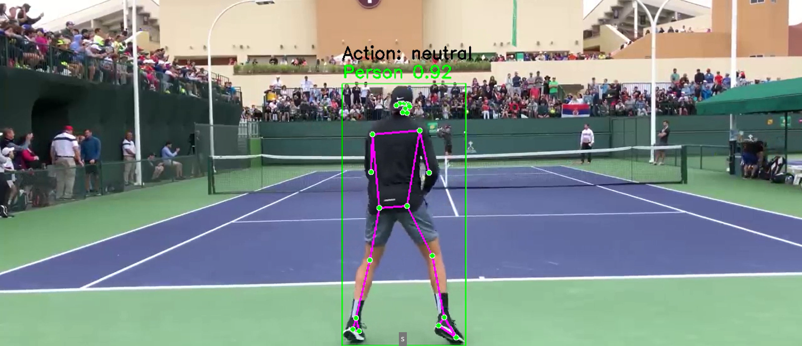

# **Tennis Strokes Classification - Deep Learning Project**

## **Overview**

The **Tennis Stroke Classification** project utilizes **Convolutional Neural Networks (CNNs)** to automatically recognize and classify different types of tennis strokes from images or videos. The system can differentiate between strokes such as **forehand, backhand, and serve**, providing valuable insights into player technique and performance.

## **Features**

- **Deep Learning-Based Stroke Recognition**: Uses CNNs for accurate classification of tennis strokes.
- **Real-time Video Analysis**: Supports frame-by-frame stroke detection in videos.
- **Automated Image Processing**: Preprocesses tennis footage for enhanced classification accuracy.


## **Technologies Used**

- **Python** - Core programming language.
- **TensorFlow/Keras** - CNN model training and inference.
- **OpenCV** - Video frame extraction and preprocessing.
- **NumPy & Pandas** - Data handling and manipulation.
- **Matplotlib/Seaborn** - Visualization of classification results.

## **Installation**

### **Prerequisites:**

Ensure you have Python installed. Then install dependencies:

```bash
pip install tensorflow numpy opencv-python pillow matplotlib
```

### **Clone Repository:**

```bash
git clone https://github.com/EnjyRamadan/Tennis-Stroke-Classification.git

```

## **How to Run**

```bash
python balltracking.py
```

## **How to Use**

1. **Upload a Video/Image**: Provide a tennis match recording or practice session.
2. **Run the Model**: The system will classify strokes from extracted frames.
3. **View Results**: Display classification results with confidence scores.

## Demo Video



[Demo - Watch here](https://drive.google.com/file/d/1ucBH6bKEkXVYGXF7tx8XTAtf4wSE10R1/view?usp=sharing)


